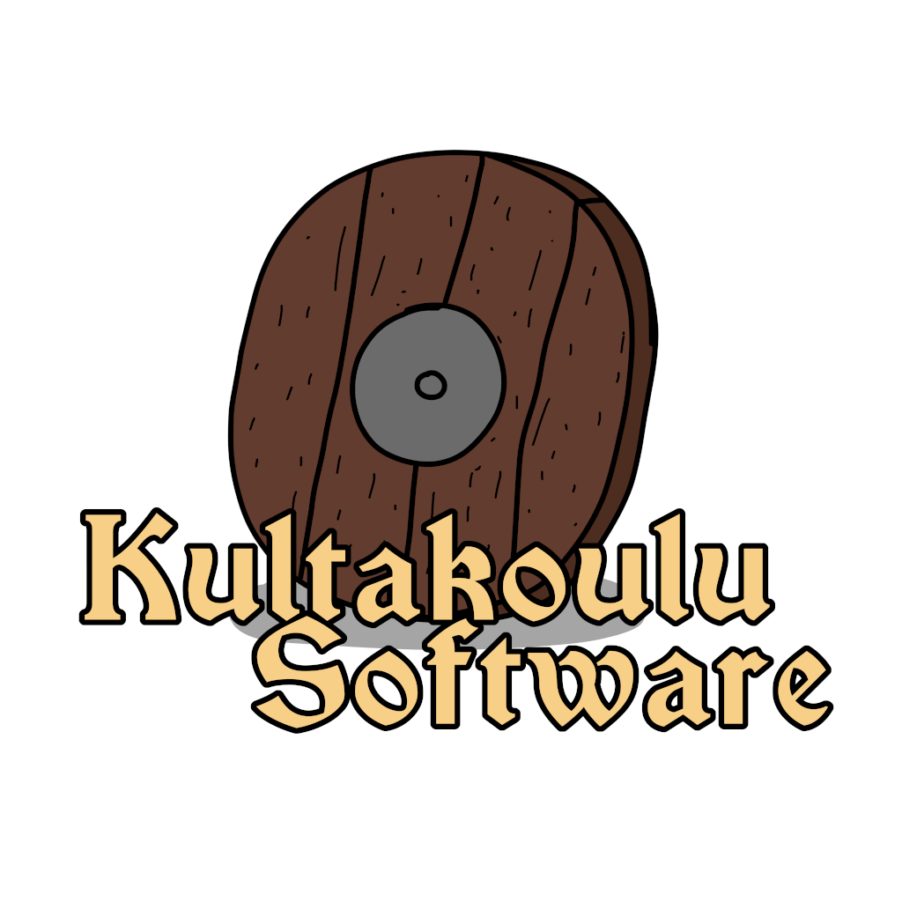
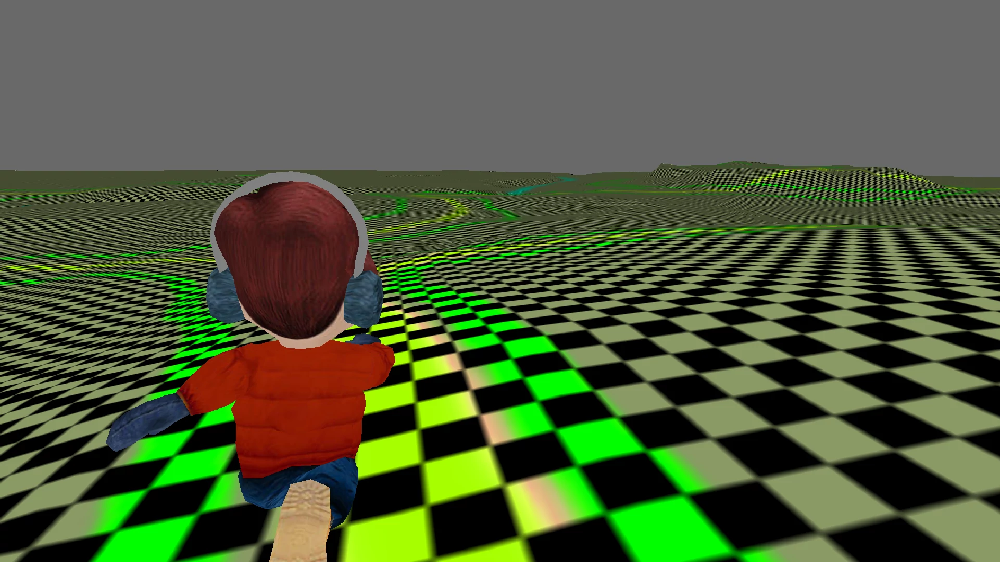

#  Third-person perspective camera for the Panda3D
Use the third-person camera with the Panda3D.



## Descrption
A more sophisticated RoamingRalphDemo. Extracted from the discontinued
Kultakoulu Software's original RPG game project. Fully working third-person
camera with a customizable relative position. The Witcher 1's styled. Contains
also a player that can walk or run on a terrain.

## Requirements
- **Python 3.6.7** (https://www.python.org/downloads/release/python-367/)
The version used for the development. Newer versions will work. Older versions
may work but I don't guarantee anything.
- **Panda3D 1.10.3** (https://www.panda3d.org/download/sdk-1-10-3/)
As above, version used for the development.

## Usage
```
pip3 install panda3d &&
cd tpp3d/src &&
./main.py
```
Then move and look around using the WSAD keys and a mouse. Toggle run or walk
by hitting the Shift key. Escape button will exit the app.

## Useful resources
- **Panda3D tutorial**
(https://github.com/fireclawthefox/panda3d-tutorial)

## Coding rules
- **PEP 20 -- The Zen of Python** (https://www.python.org/dev/peps/pep-0020/)
- **PEP 8 -- Style Guide for Python Code**
(https://www.python.org/dev/peps/pep-0008/)
- **PEP 257 -- Docstring Conventions**
(https://www.python.org/dev/peps/pep-0257/)

## Optional tools
- **the modular source code checker: pep8, pyflakes and co**
(https://pypi.org/project/flake8/)
